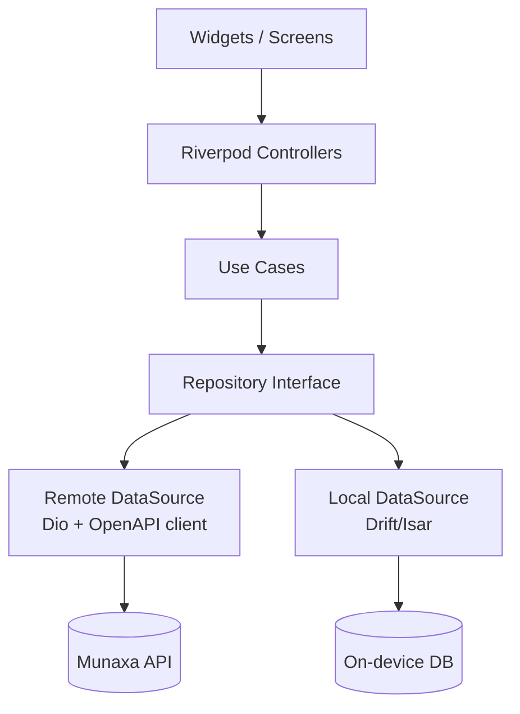
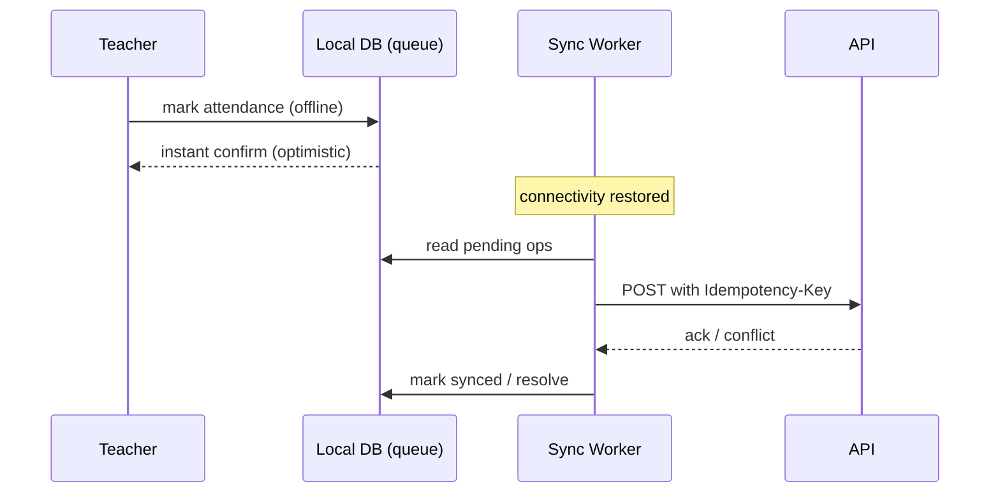

# 07 — Mobile Architecture (Flutter)

## 1. Apps & flavors

Three audiences, one codebase with **build flavors** sharing a common core:

| Flavor | Audience | Highlights |
|--------|----------|-----------|
| `parent` | Parents | Multi-child switcher, attendance/academic view, receipts, requests, comms |
| `student` | Students | Dashboard, homework, timetable, resources, gamification/streaks |
| `teacher` | Teachers | Current-class, attendance (offline), homework, behavior, comms |

Stack: **Flutter** · **Riverpod** (state) · **GoRouter** (navigation) · Dio (HTTP) · Drift/Isar
(local DB) · Firebase Auth + FCM.

## 2. Layered structure (mirrors Clean Architecture)

```text
lib/
├── core/            # config, theme, i18n (ar/en + RTL), error handling, network
├── data/            # DTOs, API clients (codegen from OpenAPI), local DB, repositories impl
├── domain/          # entities, repository interfaces, use cases
├── features/<f>/    # presentation: screens, widgets, Riverpod providers/controllers
└── flavors/         # parent / student / teacher entry points + DI overrides
```



## 3. Offline-first (mandatory for attendance — Phase 7)



- **Write-ahead queue**: actions persisted locally first, then synced.
- **Idempotency keys** per queued op → safe retries, no duplicates.
- **Background sync** via `workmanager`/background fetch on reconnect.
- **Conflict policy**: last-write-wins for simple fields; server authoritative for derived state;
  attendance edits keep an audit trail.
- Read models cached locally with TTL; stale-while-revalidate UX.

## 4. Localization & theming

- Full **AR/EN** with **RTL/LTR** mirroring; locale persisted, follows device by default.
- Design tokens from the Munaxa Design System (violet `#7A3FFF`, coral `#FF8E6E`, aqua `#4DF4E1`,
  dark surfaces) shared via the `packages/i18n` catalogs and a Flutter theme mirror.
- Numerals: Eastern/Western Arabic numerals per locale; Hijri/Gregorian dates where relevant
  (Ramadan mode in Phase 6).

## 5. Auth & security on device

- Firebase Auth for sign-in; Munaxa JWT + refresh stored in **secure storage** (Keychain/Keystore).
- Biometric unlock optional; tokens never in plain prefs.
- Certificate pinning for API; jailbreak/root awareness (warn, not block).
- Push via **FCM**; deep links open relevant screens or external LMS (Classroom/Teams).

## 6. Navigation

- **GoRouter** with declarative, role/flavor-aware routes and guarded redirects (auth, first-login
  password change, child selection for parents).
- Deep-link routes for notifications and LMS hand-off.

## 7. Quality

- Widget + unit tests (Riverpod overrides), golden tests for RTL/LTR, integration tests for the
  offline attendance flow. CI runs `flutter analyze` + tests as a separate pipeline job.

## 8. Implementation status

### Shipped
- **Three flavors** wired via `lib/main_{parent,student,teacher}.dart` → `bootstrap()` →
  `AppConfig` (flavor, app name, `API_URL`).
- **Auth-guarded routing** (`core/router/app_router.dart`, `routerProvider`): a `ChangeNotifier`
  bridges the Riverpod `authControllerProvider` to GoRouter's `refreshListenable`, and `redirect`
  resolves the destination:
  `AuthUnknown → /splash`, `AuthUnauthenticated → /login`,
  `mustChangePassword → /change-password`, `AuthAuthenticated → /` (the flavor home).
- **Session lifecycle**: `MunaxaApp` restores the persisted session after first frame
  (`AuthController.restore()` → `GET /auth/me`); tokens live in `flutter_secure_storage`.
- **Transparent token refresh**: the Dio `QueuedInterceptorsWrapper` attaches the bearer token and,
  on a `401` (non-auth route), refreshes via a bare client, persists the rotated pair, and replays
  the original request once — single-flight via the queued interceptor. Refresh failure clears
  storage and returns the app to `/login`.
- **Login** uses the API's `identifier` field (email **or** username — see ADR 15), with an
  optional school slug; a **first-login password change** screen gates the temporary password.
- **Flavor home dashboards** (read models from the existing `data/*` API clients):
  - Parent — multi-child switcher + per-child dashboard (attendance %, homework, balance, unread,
    pending leave, PTM bookings).
  - Student — gamification (points/level/streak), attendance %, homework, achievements.
  - Teacher — notification feed + unread count (attendance capture remains the offline-first flow).
- **Tests**: `test/smoke_test.dart` boots the app with an empty-token override and asserts it lands
  on the sign-in screen.

### Not yet wired (tracked for later phases)
- Drift-backed read caches / stale-while-revalidate (the attendance & presence queues already exist).
- Firebase Auth sign-in, FCM push registration, deep links, biometric unlock, cert pinning.
- AR/EN locale toggle + RTL goldens; bottom-tab sub-navigation beyond the home dashboards.
- Cross-tenant **Account/Membership** school switcher (see
  `15-identity-and-cross-tenant-membership.md`) — lands with the parent multi-school experience.
