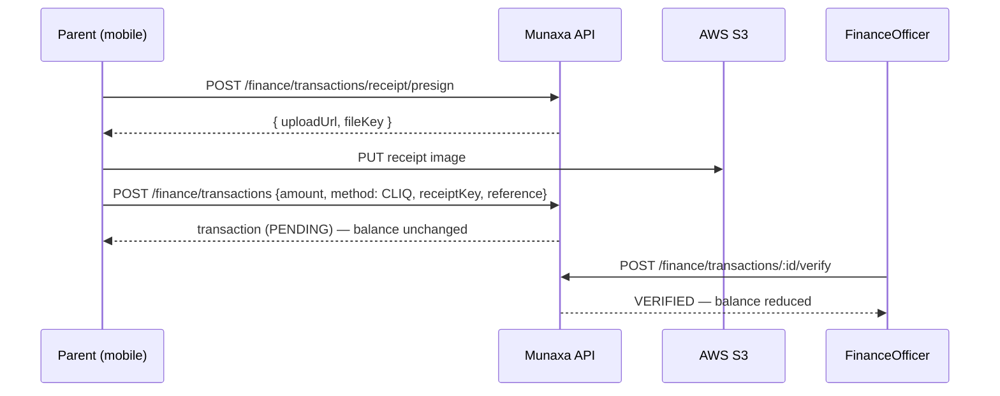

# Phase 9 — Finance

Fee plans, charges, transactions, **CliQ + e-wallet receipt uploads** (no online payment gateway),
the outstanding-balance formula, and **audit logging on every financial action**.

## 1. Deliverables

| Area | Where |
|------|-------|
| DB models + RLS | `prisma/migrations/20260603180000_finance/` (FeePlan, Charge, Transaction) |
| Audit helper | `TenantRepository.writeAudit` (same-transaction audit) |
| Backend | `apps/api/src/finance/{fee-plans,charges,transactions,statement}` |
| Admin Portal | `apps/admin/src/app/finance`, `src/lib/finance.ts` |
| Parent mobile | `apps/mobile/lib/data/finance`, `lib/features/finance` |
| e2e | `apps/api/test/finance.e2e-spec.ts` (6 cases) |

## 2. Model & money
- **Money** is `Decimal(12,3)` (JOD has 3 minor units). Sums use `Prisma.Decimal` (never float).
- **FeePlan** — a reusable fee template (amount + recurrence).
- **Charge** — an amount a student owes (optionally from a fee plan); excluded from the balance when
  `CANCELLED`/`WAIVED`.
- **Transaction** — a payment. CliQ/e-wallet payments carry a `receiptKey` (S3) + `reference` and
  start **`PENDING`** until a FinanceOfficer **verifies** (or **rejects**) them.

## 3. No gateway — receipt-based payments



## 4. Outstanding-balance formula

```
Outstanding Balance = SUM(Charges)  −  SUM(verified Transactions)
```

`GET /finance/students/:id/statement` returns the charges, transactions, and totals
(`charged`, `paid`, `outstanding`) computed with `Prisma.Decimal` and returned as fixed-3 strings.
**Pending payments do not reduce the balance** until verified.

## 5. Audit logging (mandated)

Every financial state change writes an `AuditLog` **in the same transaction** as the change (via
`TenantRepository.writeAudit`), so the action and its audit commit or roll back together:
`finance.feeplan.create`, `finance.charge.create`, `finance.transaction.create`,
`finance.transaction.verify`, `finance.transaction.reject`.

## 6. API & permissions (`/api/v1`)

| Method | Path | Permission |
|--------|------|------------|
| CRUD | `/finance/fee-plans` | `finance:manage` / `finance:read` |
| POST/GET | `/finance/charges` (`?studentId`) | `finance:manage` / `finance:read` |
| POST | `/finance/transactions/receipt/presign` | `receipt:upload` (parents + finance) |
| POST | `/finance/transactions` | `receipt:upload` |
| POST | `/finance/transactions/:id/verify` · `/reject` | `finance:manage` |
| GET | `/finance/transactions` (`?studentId`) | `finance:read` |
| GET | `/finance/students/:id/statement` | `finance:read` |

## 7. Verified behavior (e2e, real DB)
- ✅ Create fee plan + charge → statement shows charged 750 / outstanding 750.
- ✅ A **Parent uploads a CliQ receipt** (presign → PENDING transaction); balance unchanged
  (paid 0, outstanding 750).
- ✅ FinanceOfficer **verifies** → **outstanding 0** (750 − 750), by the formula.
- ✅ **Audit log written for every financial action** (≥ 4 `finance.*` entries).
- ✅ CliQ payment with no receipt/reference → 400.
- ✅ RBAC: a Parent cannot create charges (403).

## 8. Admin & Mobile
- **Admin** `/finance`: student statement (charged/paid/outstanding), add a charge, and
  **verify/reject** pending payments.
- **Parent mobile**: `FinanceApi.uploadReceiptAndPay` (presign → S3 PUT → record payment) and
  `statementTotalsProvider` for a child's outstanding balance.

## 9. Notes
- Charge `status` auto-transitions (PARTIAL/PAID) are a planned enhancement; the balance is always
  authoritative via the formula.
- Receipt object keys are tenant-namespaced; AV scanning lands in Phase 15.

## Next: Phase 10 — Communication System
Announcements, push notifications (FCM), notification center, parent/teacher communication, and the
feature-flagged WhatsApp bridge.
